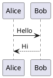

# コンテンツをここに追加してください

共有リンクで示されたチャット履歴のコンテンツをこの `content.md` に貼り付けると、ページ上で Markdown として整形されます。以下はプレースホルダーの例です。

## 例: 表示確認用の表

| 項目 | 値 |
| --- | --- |
| サンプル | 123 |
| メモ | ここに追記 |

## 例: PlantUML



## 例: コードブロック

```bash
npm run build
```
